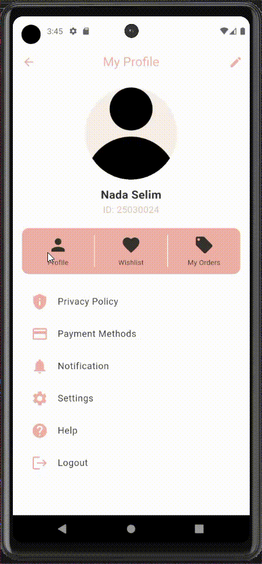

Flutter Profile Task
====================

Flutter Profile Task is a Flutter-based application designed to manage user profiles with interactive screens for viewing and editing user information, as well as tracking orders. It features a clean and modern interface with Firebase integration for data management.

Table of Contents
-----------------

-   [Features](https://grok.com/chat/c545f7ba-cdff-4532-9363-048e17f4cf79#features)
-   [Demo](https://grok.com/chat/c545f7ba-cdff-4532-9363-048e17f4cf79#demo)
-   [Getting Started](https://grok.com/chat/c545f7ba-cdff-4532-9363-048e17f4cf79#getting-started)
-   [Dependencies](https://grok.com/chat/c545f7ba-cdff-4532-9363-048e17f4cf79#dependencies)
-   [Contributing](https://grok.com/chat/c545f7ba-cdff-4532-9363-048e17f4cf79#contributing)

Features
--------

-   **Profile Management**: View and edit user details including name, email, phone, date of birth, and gender.
-   **Profile Picture Upload**: Upload and update profile pictures using Firebase Storage.
-   **Order Tracking**: Display a list of orders (dummy data) in the My Orders screen.
-   **User-Friendly Interface**: Intuitive design with reusable widgets and a customizable theme.
-   **State Management with GetX**: Efficient state management using GetX for scalability and performance.
-   **Firebase Integration**: Utilizes Firebase Firestore for user data and Firebase Storage for images.

Demo
----

Watch the app in action:



Getting Started
---------------

### Prerequisites

To run the Flutter Profile Task app, ensure you have the following installed:

-   Flutter SDK
-   Android Studio or Visual Studio Code with Flutter/Dart plugins
-   A connected device or emulator
-   Firebase project configured (for authentication and storage)

### Installation

1.  **Clone the repository**

    ```
    git clone https://github.com/<your-username>/flutter_profile_task.git

    ```

2.  **Install dependencies**\
    Ensure Flutter is installed on your system. Then, run the following command:

    ```
    flutter pub get

    ```

3.  **Set up Firebase**

    -   Create a Firebase project and add the app to it.
    -   Download `google-services.json` (Android) or `GoogleService-Info.plist` (iOS) and place it in the appropriate directory.
    -   Update `firebase_options.dart` with your Firebase configuration.
4.  **Run the App**

    ```
    flutter run

    ```

Dependencies
------------

This project uses the following key packages:

-   **Firebase**: `firebase_core`, `cloud_firestore`, `firebase_storage`, `image_picker` for real-time data and image handling.
-   **GetX**: `get` for state management and navigation.
-   **Flutter Widgets**: For a responsive and dynamic UI.

Contributing
------------

Contributions are welcome! Please follow these steps:

1.  Fork the repository.

2.  Create a feature branch:

    ```
    git checkout -b feature-name

    ```

3.  Commit your changes:

    ```
    git commit -m "Add feature description"

    ```

4.  Push to your branch:

    ```
    git push origin feature-name

    ```

5.  Submit a pull request.